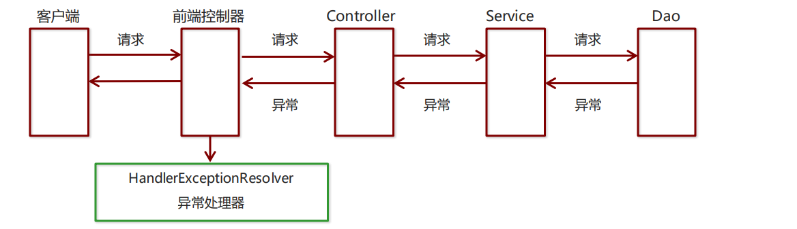
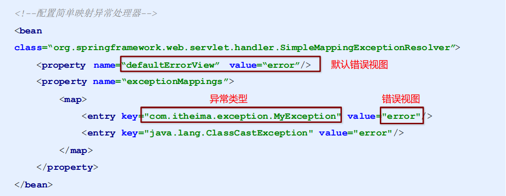

## `SpringMVC`的异常处理

#### 1、异常处理的思路

系统中异常包括两类：预期异常和运行时异常`RuntimeException`，前者通过捕获异常从而获取异常信息，后 者主要通过规范代码开发、测试等手段减少运行时异常的发生。

 系统的`Dao`、`Service`、`Controller`出现都通过`throws Exception`向上抛出，最后由`SpringMVC`前端控制器交 由异常处理器进行异常处理，如下图：



#### 2、异常处理两种方式

* 使用`Spring MVC`提供的简单异常处理器`SimpleMappingExceptionResolver`
* 实现Spring的异常处理接口`HandlerExceptionResolver `自定义自己的异常处理器

#### 3、简单异常处理器`SimpleMappingExceptionResolver`

`SpringMVC`已经定义好了该类型转换器，在使用时可以根据项目情况进行相应异常与视图的映射配置



```xml
<!--配置简单映射异常处理器-->
<bean 
class=“org.springframework.web.servlet.handler.SimpleMappingExceptionResolver”>
    <property name=“defaultErrorView” value=“error”/>
    <property name=“exceptionMappings”>
    <map>
        <entry key="com.example.exception.MyException" value="error"/>
        <entry key="java.lang.ClassCastException" value="error"/>
    </map>
    </property>
</bean>
```

#### 4、自定义异常处理步骤

① 创建异常处理器类实现`HandlerExceptionResolver`

```java
public class MyExceptionResolver implements HandlerExceptionResolver {
    @Override
    public ModelAndView resolveException(HttpServletRequest request, 
        HttpServletResponse response, Object handler, Exception ex) {
        //处理异常的代码实现
        //创建ModelAndView对象
        ModelAndView modelAndView = new ModelAndView();
        modelAndView.setViewName("exceptionPage");
        return modelAndView;
    }
}
```

 ② 配置异常处理器

```xml
<bean id="exceptionResolver" class="com.example.exception.MyExceptionResolver"/>
```

 ③ 编写异常页面

```jsp
<%@ page contentType="text/html;charset=UTF-8" language="java" %>
<html>
    <head>
    	<title>Title</title>
    </head>
    <body>
   	 这是一个最终异常的显示页面
    </body>
</html>
```

 ④ 测试异常跳转

```java
@RequestMapping("/quick22")
@ResponseBody
public void quickMethod22() throws IOException, ParseException {
    SimpleDateFormat simpleDateFormat = new SimpleDateFormat("yyyy-MM-dd");
    simpleDateFormat.parse("abcde");
}
```

#### 5、 知识要点

**异常处理方式**  

* 配置简单异常处理器`SimpleMappingExceptionResolver` 

* 自定义异常处理器

**自定义异常处理步骤**

① 创建异常处理器类实现`HandlerExceptionResolver `

② 配置异常处理器 

③ 编写异常页面 

④ 测试异常跳转